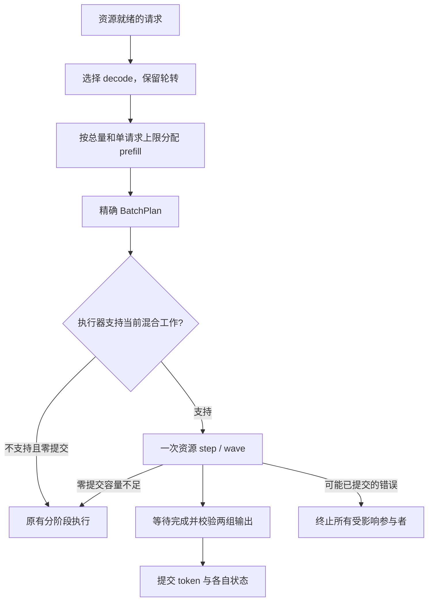

# Prefill / decode 调度设计

状态：调度预算、mixed 路径、CUDA 合批与严格中行矩阵分派、显式 Q8 SwiGLU profile、Metal linear 分派与 grouped attention 合批、大词表 argmax 已实现；Mixed 和 Q8 profile 仍需各自显式选择。本文记录当前设计、验证范围与待验证项，不据实现完成宣称达到跨引擎性能目标。机器相关测量结果、日志、profile 与二进制存放在仓库之外。

## 目标与边界

单 GPU 上已经提交的一轮推理不能由调度器随意中断。因此，保护正在生成的请求，需要控制两次 decode 推进之间安排的工作量。把 prefill 与 decode 放进同一次 forward 能减少重复工作，但同一轮仍有共同完成屏障，不能将“混合执行”理解为 decode 会提前穿过长 prefill 返回。

优化目标是在可接受的 decode 间隔下尽量提高有效吞吐，并报告新请求的首字时间。没有脱离模型、硬件、上下文和目标负载的统一最优 chunk。小块增加调度、提交、checkpoint 和 decode 轮次；大块会增加单轮等待。输出有效性、容量安全和可恢复的请求状态不参与这项性能交换。

[vLLM 的配置文档](https://docs.vllm.ai/en/latest/configuration/optimization/#chunked-prefill)把 decode 优先、剩余 token 预算分配和分块结合，并明确 ITL、TTFT 与吞吐之间的取舍。[Sarathi-Serve](https://www.usenix.org/conference/osdi24/presentation/agrawal)研究了分块与混合批次的结合。这些提供架构参考，不意味着论文或其他引擎的最佳参数适用于 Ferrum。

本轮参考 vLLM V1 scheduler 的 token budget 与统一 token 工作集合，以及 model runner/provider 对合并矩阵的实际执行。这里的并发指多个请求参与同一调度轮和设备批次；没有引入操作系统线程级的 prefill/decode 抢占，也不要求把两类 kernel 放进独立 CUDA stream 同时执行。llama.cpp 的 GGUF block 解码、批处理和矩阵 kernel 是另一组实现参照。Ferrum 保留原始压缩权重和资源权威，按选定的数值契约执行。严格 CUDA 路径改善已有 kernel 的合批与数据复用；另外已通过显式 `qwen3_5.f32-master.q8-swiglu` profile 接入 FFN 激活量化和整数点积/MMA，不改变 `Auto` 的原有选择。两者需要分别验证和报告，不能将 Q8 profile 的收益归为相同数值契约下的优化。

## 三类约束各司其职

| 约束 | 含义 | 所在层 |
|---|---|---|
| 资源上限 | token、sequence、KV、recurrent state、scratch 等实际容量 | typed admission / PlanRuntime |
| 调度工作量预算 | 有 decode 时，本轮可以安排多少 prefill 工作 | scheduler |
| 执行方式 | 入选工作使用 mixed、单阶段批次或安全回退 | executor / engine |

资源允许执行一个大批次，并不说明它满足交互延迟目标。调度器不能为了改善耗时绕过资源权威；执行器也不能为了合批多推进未入选的 token。

现有调度器已经优先选择 decode，并在宽度受限时轮转。它也有单请求 prefill chunk 限制和整轮总量计算。原有总量大致为 `min(剩余 token 容量, 有效 chunk × 可用 prefill 槽位)`，所以单请求上限不是与并发数无关的整轮上限。未配置 active chunk 的低 decode 并发还可能使用全部剩余 token 容量。

## 独立的整轮 prefill token 预算

新增可选 `SchedulerConfig.active_decode_prefill_token_budget`，通过两种产品入口的 `--scheduler-active-decode-prefill-token-budget` 以及对应配置项设置。默认 `None`，不根据单次测试自动改成某个数字。已有 `active_decode_prefill_chunk` 继续表达单请求限制。

设：

- `B`：本轮实际 token 容量；
- `D`：本轮入选的 decode token 数；
- `Q`：显式配置的 active-decode 总 prefill 预算；
- `Pᵢ`：第 i 个入选 prefill 的计划推进长度。

有可运行 decode 且启用 `Q` 时，必须满足：

```text
Σ Pᵢ ≤ Q
D + Σ Pᵢ ≤ B
```

各请求仍服从自己的 chunk、剩余 prompt、容量反馈和 checkpoint 边界。`Q` 不乘空闲 sequence 数，也不依赖 decode 数达到某个比例才生效。只有 prefill 时不使用 `Q`，保留原有弹性预算。

初始请求组的 fill-first 不能覆盖显式的 decode 保护：一旦有可运行 decode，应先安排它，再分配 `Q`；没有 decode 时仍可优先填充冷启动请求组。资源维护、等待 epoch、准确 frontier 和 preemption 继续使用现有机制。

该参数限制 token 工作量，**不承诺固定毫秒延迟**。它提供一个可解释、可复现的控制量，也为后续时间控制器提供独立接口。

### 调度分块与 GDN 算子分块

调度器把一个长 prompt 分多轮推进，与 Gated Delta 算子如何计算本轮 token，是两个独立选择。CUDA 已支持前者；当前 GDN provider 选择 `RecurrentScan`，并未安装 `ChunkedScan` 执行路径。因此，调小 prefill chunk 可以缩短一次占用，却不会自动把块内的顺序递推变成并行算法。

Metal 已有 recurrent 与 chunked 两种实际实现，但安装了 kernel 不等于运行时会选中它。当前 cost model 对受支持的 SIMD recurrent 形状优先使用 recurrent，即使输入较长。后续优化需要按实际 token 数、head 维度、状态精度和设备能力比较两条路径，并验证状态衔接与数值误差；不能仅凭“已有 chunked”推断长 prefill 已充分并行。

## 公平性与过载

decode 保持已有轮转；prefill 保持已有队列顺序，不在同一个改动里引入新的 aging 或优先级规则。只要有可运行 prefill、正预算和可用资源，调度必须允许它推进。较小的总预算可能延长队首长 prompt 后面请求的 TTFT，需要在长短请求混排测试中展示。

如果 decode 已占满实际 sequence/token 容量，新的请求只能排队或受到 admission/backpressure 限制。不能同时承诺无限输入负载、既有请求固定延迟和新请求有限等待。token 总预算也不替代队列或最大并发限制。

## Mixed 是对已选工作的一次执行



PlanRuntime mixed API 保留两组输入和各自顺序，共享物理执行并分别提交 prefill 和 decode 的状态。它遵守以下契约：

1. `Unsupported` 不改变输入 frontier；`NotSubmitted` 证明没有 provider encode/device submission，保留可重试状态。只有这两类结果允许回退。
2. maintenance 或 request-state 等待只影响其明确列出的请求；这些请求不能在同一轮再次 fallback。
3. 普通错误可能发生在提交之后，不能重放任何参与者。清理一个请求失败，也要继续终止同一轮的其他参与者，再汇总错误。
4. 两组输出的数量、身份、chunk 和采样契约全部通过校验后，才允许发布 token。非 final prefill 只提交实际推进长度；final prefill 才采样首 token。
5. decode 保留既有 sampling processor、stop、stream 和 usage 语义。按参与者实际输出策略选择 FullLogits 或 GreedyToken，不能只凭请求的 temperature 猜测是否允许设备采样。
6. 取消和提交后错误依靠资源 guard 清理准确参与者；设备 fence 继续持有实际资源，直到设备执行结束。

当前 mixed 路径仍等待整轮 forward 和必要的 prefill 边界保存。`BatchConfig.prefill_decode_execution` 使用 typed `Split` / `Mixed` 策略，默认保留 `Split`；`run` 和 `serve` 可通过 `--prefill-decode-execution mixed` 显式选择。Mixed 使用 packed-token 执行，仍可能失去纯 decode 的部分专用执行优势。因此，默认启用范围必须由相同调度工作量下的对照结果支持；不能把调小预算带来的改善归因于混合执行。对诊断 checkpoint 等不兼容执行契约，使用明确的 Unsupported 回退。

### CPU 准备与 GPU 执行的重叠边界

CUDA 的整轮 graph replay 已存在；它减少设备提交开销，但当前 engine 仍在本轮完成、回读和状态提交之后，准备下一轮。优化方向之一是减少重复的 host 绑定工作，再评估有界的批次流水，避免 GPU 等待下一轮 CPU 准备。Mixed 本身不建立这种跨轮重叠。

当前执行路径不包含跨轮前瞻流水。一步前瞻实验因端到端对照未显示净收益而撤回，相关开关及专属双帧资源协议一并移除；普通完成任务、读回和资源清理仍保留。实验提交保留在 Git 历史中。

### Mixed 的小回传边界

参与者分别标记为 `IntermediatePrefill`、`FinalPrefill` 或带实际 `LogitsReturnPolicy` 的 `Decode`。仅当本轮至少有一个 decode、所有 decode 都是 `GreedyArgmax`、且 prefill 全部为中间块时，才选择 `GreedyToken`。任何 final prefill 或需要 host processor 的 decode 都使整轮保留 `FullLogits`；纯 prefill 也保留 FullLogits。token mask 和支持的 repetition penalty 继续来自实际 decode policy，不为了启用小回传而去掉处理器。

该优化减少设备到主机的输出传输和 host logits 处理。完整设备计划仍为 intermediate prefill 执行输出计算，其内部返回值被丢弃，不发布 token；这不是跳过 LM head 的优化。final prefill 仍必须经过完整 logits 和首 token 采样。相关角色检查与真实 CPU 模型测试覆盖 mask、repetition penalty、中间块、最终块和需要 host logits 的混合参与者。

### 合批收益需要验证到 provider

共享一次 wave 和 packed 激活不自动意味着每个算子都处理合并后的矩阵。需要检查实际 provider 的 launch：投影与 MLP 是否共享总 token 矩阵，attention/recurrent state 是否仍按请求独立推进，以及物理权重分区、scratch、dispatch 归因是否正确。CUDA native GGUF 的初始候选曾逐 participant 执行 dense linear / SwiGLU；当前已修正，不能再用该初始实现的结果代表当前物理合批。

CUDA native dense linear / SwiGLU 使用现有多行 kernel：所有请求维度和物理权重一致、输入输出均为同一 packed 区域、总行数与索引合法时，按总 token 数建立 launch。非 packed 布局或超出单次 launch 上限的合法批次继续使用原逐请求路径。SwiGLU 沿用按总 token 数分配的 scratch；不扩张 admission 预算，不复制或展开权重。replay key、provider fingerprint 和实际 dispatch 计数一起更新。实际 CUDA profile 已观察到 packed SwiGLU 的 dispatch 数不随 participant 数成倍增长；投影、激活和 down 仍是各自的物理工作，不是单 kernel 融合。

### CUDA 算子与 LM head

- **Dense FP16 LM head**：多参与者各有一个 token、token range 从零连续覆盖，且实际输入、输出 row region 的地址与字节数分别组成连续矩阵时，使用一次零拷贝多行 cuBLAS GEMM。mixed/prefill 的最后行不连续时，若输出行确实连续，则先在同一 stream 上收集最后行，再使用一次 GEMM。收集区由 typed workspace 按实际 sequence 数分配，每行 `hidden_size × 2` 字节，纳入原 admission 预算，没有临时设备分配。所有输入、输出、权重和 scratch 都保留到 fence 完成；实际访问范围、溢出和读写别名先校验。合法但不满足连续输出或 scratch 隔离条件的布局沿用逐行路径；非法输入输出别名返回错误。replay key 包含执行模式、复制映射和 scratch，runtime 同时绑定实际地址与范围。CPU 边界测试及真实 CUDA 的零拷贝、收集、逐行/F64 oracle 已通过；完整服务 mixed 路径的提交归因与吞吐仍单独验证。F32 和量化权重路径保持原实现。
- **Q4K 格式特化**：未选中 shared GEMM 的 F16 输入/输出使用专用 RowTile 1/8 kernel，将 Q4K 的 256-value、144-byte block 格式变成编译期常量，保留原始 GGUF bytes、lane 内 F32 累加顺序和 warp reduction。旧 generic 出口保留作为数值与性能对照；本项不改变 F32 或其他格式的 kernel。实际 CUDA 已完成 generic 逐 bit 与独立 F64 对照。这是减少格式解码开销，没有引入 Tensor Core 或新 scratch。
- **严格 Q5K/Q6K 中行分派**：F16 输入/输出、rows ≥ 32 且无 transform 时，按每个物理权重 part 的输入宽度 K 和输出宽度 N 选择现有 shared GEMM。Q5K 要求 `K ≥ 4096 且 N ≥ 2560`，或 `K ≥ 2560 且 N ≥ 8192`；Q6K 要求 `K ≥ 4096 且 N ≥ 4096`。原有 rows ≥ 128、N ≥ 128 的大行路径保留，Q4K 不新增中行资格。kernel 仍按 F32 重建权重、相乘与累加，输出写回 F16；没有新增激活量化或 Tensor Core 运算。不满足条件的 part 沿用原分派，不能用拼接后的逻辑输出宽度替代单个 part 的 N。选择器边界、非零偏移、尾行和独立 F64 oracle 分别验证；不同归约次序不承诺逐 bit 相同。
- **Gated Delta recurrent scan**：仅 F32 state、key dimension 128、value tile 16、256-thread launch 进入 warp/register 专用路径。在同一 sequence chunk 内将 state 留在寄存器，只读初始 state、写最终 state，保留原 128-key 归约树、slot/head 映射和 launch/scratch 布局。F16 state 的逐步存储舍入和其他形状保持旧实现。真实 CUDA oracle 覆盖 chunk carry、空 sequence、分离 state slot，以及 grouped/interleaved head 布局；这些不构成所有 GDN 形状的性能保证。

Q4K 和 GDN kernel 修改属于仓库核心 CUDA 源码，会使对应 PTX 内容缓存失效；严格中行分派复用已安装的 shared GEMM。这些修改不需要替换外部 native operator-set lock，CUDA 构建仍使用项目要求的锁和 feature 组合。kernel 微基准的加速不能直接当作整模型收益，混合格式 profile 也不能把所有 tiled GGUF 时间都归到 Q4K。

### 显式 Q8 SwiGLU 数值契约

`run` 与 `serve` 可通过 `--numerical-profile qwen3_5.f32-master.q8-swiglu` 选择 CUDA SM80 及以上设备的 Q8 FFN 路径。它只量化原生 GGUF Q4K/Q5K/Q6K SwiGLU 投影的激活：每 32 个 F16 输入使用一个 F32 scale，打包为有符号 I8，整数点积后以 F32 缩放与累加。rows ≥ 8 使用整数 MMA，较少行使用 DP4A 映射。原始压缩权重不重排，gate/up、SiLU 结果和 FFN 输出保留原 F16 舍入边界；attention、GDN 投影与递推、LM head 以及其他权重格式不因该 profile 改用 Q8。

该 profile 要求非 MoE、无 Hadamard 旋转、negative-rate recurrent ABI、F16 KV，以及至少一个满足完整 K256 分组的 FFN Q4K/Q5K/Q6K 权重。它不进入 `Auto`，不是原 F32-master 契约下的隐式 kernel 替换。激活打包 workspace 纳入原有资源规划，gate/up 共用打包，down 复用空间后重新打包；显式选择在缺少对应 provider 或资源不可满足时按既有规划规则拒绝执行。数值误差、模型输出有效性和含打包成本的服务性能需要分别验证，详见[数值执行契约](numerical-execution.zh.md)。

kernel 的分块边界也是工作量的一部分。Metal Q4K 的 tiled GEMM 以 32 行为一个 token tile，64 个 prefill token 加一个 decode token 会跨越第三块。验证时应同时比较相邻预算的 split / mixed，固定模型、客户端与输入输出长度，区分合批收益与分块效率；不能把某个测试最好的 token 数写成通用默认值。对来源不同的结果，分别标明已观察现象、源码确认的行为与尚未完成的性能归因。

### Metal 尾行与四行分组（已实现）

普通 quantized linear 使用准备期 `PlainLinearPlan` 统一决定分派与计数，复用现有 kernel：

| 条件 | 物理执行 | 作用范围 |
|---|---|---|
| Q4K、F16、rows > 32 且 rows % 32 = 1、输出宽度 ≥ 1024 | 完整 32 行 tiles + 单行 GEMV，如 65 → 64 + 1 | 避免一个尾 token 多执行整块 GEMM |
| Q6K、F32、8 ≤ rows ≤ 32、输出宽度 ≥ 1024 | 按四行分组，共 ceil(rows / 4) 次 dispatch；不足四行的尾组使用原 B1/B2/B3 | 复用组内权重解码，包括满足条件的 vocabulary head |
| Q4K/Q6K、F16、rows = 8、输入和输出宽度均 ≥ 1024 | 两次已有 B4 shared-weight GEMV | 避免八行只占 32 行 GEMM tile 的四分之一 |
| Q5K、F16、rows = 8、输入和输出宽度均 ≥ 1024、输出宽度小于输入宽度 | 两次已有 B4 shared-weight GEMV | 实测收缩投影获益；扩张投影的同一改法退化，因此保留原 GEMM |

未列入表格的形状保持已有分派；Hadamard 路径也保持原策略。F16 八行分组的 K 下界让 Q4K B4 reduction 的四个 256-value block lane 都有工作，不按模型名称或某一型号的精确维度选择。F32 Q6 的四行分组限制到 rows = 32，更大 prefill 不拆成无界的小 dispatch 序列。`group.y` 在现有 B4 shader 中不参与行寻址，因此必须实际编码各组带正确偏移的 dispatch，不能只扩大同一 kernel 的 grid.y。

已经落实的约束包括：

- 按完整输入宽度和输出行跨度计算尾部地址，保留每个权重 part 的列偏移；验证非零 region/token offset、拼接输出、保留区间和越界保护。
- 用同一 prepared plan 决定实际编码与 dispatch 计数。已选 staging 的投影绕过普通 linear 分派，仍计为 dequantization + GEMM 两次 dispatch。物理投影拆分仍属于同一个 packed batch，不改变逻辑 batch 或同轮完成屏障。
- GEMV 与 MMA 的反量化和累加次序不同，使用独立数值 oracle 和原有误差标准验证，不假设逐位相等。provider fingerprint 包含分派计划源码，测试检查相同准备期计划的重复执行；Metal 当前声明 `bitwise_eager_only`，不能据此声称支持 replay。
- 真实 Metal 测试覆盖非零 retained/local offset、输出 stride/part 列偏移、truncated view 拒绝、相邻 tile 边界、F32 Q6 的不完整尾组与范围外回退。尾行 fixture 还包含 dense 输入、强消减和大动态范围，参考值由独立源 block 解码后以 F64 累加。
- 配对微基准在一个 command 内连续编码多个逻辑 projection，按实际 projection 次数归一，CPU oracle 和 guards 校验放在计时外；C4 或未改形状作为同路径控制，AB/BA 交替。尾行、Q6 F32 head 以及 F16 down/gate-up/square 已做这一局部测量；新的组合仍需固定预算下的端到端吞吐、TTFT 与 decode 间隔复测。

F32 Q6 分组的部分 fixture（包括稀疏输入微基准）与旧逐行 GEMV 逐 bit 一致，但生产分派的 dense 输入对照已观察到旧/新 pipeline 的舍入差异，并通过原有误差标准；不能将局部逐 bit 结果推广为跨 pipeline 保证。F16 Q6 的 GEMM/B4 同样按既有误差标准验证。同一 prepared eager 路径的重复性与不同算法之间的数值容差是两项检查。这些 provider 改动同样影响纯 decode、纯 prefill 和 Split，Mixed 的 opt-in 不能替代它们的回归检查。调度器继续管理 token 预算，不把某个最佳相邻预算固化为默认值。

### Metal grouped attention 的独立请求合批

packed causal attention 中至少两个参与者都选中原 `GroupedDecode`，且具有相同 head dimension、query/KV head 数、可用的特化 pipeline 和 F16 KV 时，可合并 attention core dispatch。原 grouped 资格仍要求每个参与者仅推进一个 token、上下文至少 256、head dimension 为 128 或 256、每个 KV head 对应 4 或 8 个 query heads（D = 256 还支持 6），以及兼容八 token 矩阵读取的分页布局。各请求的上下文长度和页偏移可以不同；INT8 KV、mixed 中的多 token prefill 或不满足资格的参与者沿用原路径。

合批前按保留的物理 allocation 身份及页偏移排序，拒绝任何页范围重叠，包括同一请求的重叠页和不同请求共享的只读 prefix。相邻但不重叠的同 allocation 子视图可以通过；无法证明独立时保留逐参与者 prepare → core 顺序。通过后才改为先完成所有 prepare，再以 grid.z 表示参与者，执行合并的 partial 与 reduce。两种入口复用相同 shader body、每行分区和归约规则；不改变请求状态、注意力数学或原数值契约。scratch、页表和 KV 仍由原 command 保留到完成，使用现有资源依赖保证 prepare 的写入先于 core 的读取。

每个 104 字节的行描述符由 command 复制，单批最多 39 行；更多参与者分批提交。attention core 从每个参与者两次 dispatch 改为每 39 行两次，prepare 仍逐参与者执行，投影的额外物理拆分仍计数。资格、共享/嵌套页拒绝、相邻页通过、非零 scratch/page-table 偏移、异长上下文、跨描述符批次，以及 prepare 重排前后的输出、query 和完整 KV/guard 对照都有测试入口。减少 dispatch 的局部收益仍需服务吞吐和尾延迟对照，不能直接推广到不满足资格的 attention 或 GDN。

### 大词表 masked argmax

Metal 的词表宽度至少为 8192、CUDA 至少为 65536 时，无有效 repetition penalty 的设备 argmax 使用 32 个分区计算局部最大值，再由一次 finalize 选择 token。局部结果复用每个参与者原 scratch 的前 256 字节，不增加资源预算。保留 token mask、非有限值过滤、最低 token index 的 tie 规则及全无效值的 sentinel；有效 repetition penalty 继续执行原处理顺序和 F16 存储舍入，finalize 不再改写其结果。小词表保留原单次 dispatch。CUDA 使用更高下界，是因为实际小词表测试中额外 launch 的成本会放大 penalty fallback 开销。

两个后端已通过实际设备数值与边界测试，包括词表阈值、分区边界、非有限值、相等最大值、稀疏 repetition policy、非零偏移、多参与者 scratch 及重复调用。Metal 的现有 tracked buffer/顺序 encoder、CUDA 同 stream 保证分区与 finalize 的依赖；命令保留区域到完成 fence，dispatch 计数和缓存 fingerprint 同步更新。大词表无 penalty 的微测收益显著，但不能将其倍数直接当作模型加速。CUDA 组合的固定负载前后实验另行记录；Metal 首轮组合初筛没有表现出明确端到端提升，仍需解决以下资源与测试口径问题。

### 执行缓存与连续缓冲区碎片

真实 CUDA trace 显示，配置的并发上限为 8 时，decode 曾在宽度 5 被 `fragmented_contiguous` 拆成更小 cohort。阻塞池是按参与者分配的 U8 vocabulary mask；总空闲字节足够，但历史增长产生的多个小 chunk 无法拼成较大的连续 bucket。旧的 1/2/4-row lane-stable buffer 仍由执行缓存持有。Metal 初筛结束后的同一池也显示相同碎片形态；仅凭该快照不能证明那次运行的实际 decode 宽度。

这属于物理资源维护问题，不能通过忽略 admission、增大调度 batch 或将配置上限当作实际批宽解决。已有 sealed execution catalog 的地址持有契约继续有效。修复只在真实 pool-resident pressure 下，重新核对完整的 contiguous claim 集合，回收该池完全空闲且无外部引用的整块，再经原预算检查申请较大的块。每个候选块及累计选中的块都在 allocator 副本中模拟，必须保留完整 claim 集合的原增长需求；小的伴随分配同样受保护。live/pinned backing 不搬移，池上限不扩大；回收不足时不改变状态，分配失败或竞争申请仍按真实容量结果处理。

第一轮只保护 singleton 的版本已在 Metal、4050 和 4090 确认能回收 U8 池，但随后暴露 U32 池的多 claim 碎片，实际 decode 仍拆批，未获得并发收益。因此不能将某一个池的回收成功当作整个批次已恢复。多 claim 实现加入了实测四块需求及保留小块、累计删除无解等回归；完整批宽与端到端性能仍以新硬件结果为准。

多 claim 回收与下述维护预算修复组合后，Metal 的实际请求已连续完成 31 个八路纯 decode wave；4050 与 4090 也均观察到八路物理执行及已测量的 reusable span。这些证据关联实际参与请求、输入 frontier、提交与完成，不以配置中的 `max_sequences=8` 代替执行证明。维护期间仍可能出现可恢复的 backing/admission deferral；不能将消除碎片拆批表述为整个运行没有任何等待。

执行器原有两次维护预算也会在多个池依次需要增长时过早耗尽。现在仅根据本次 admission 调用中、同一 plan 的成功 typed growth receipts，为每个首次实际增长的池提供一次额外探测机会。同池重复增长、仅 epoch 变化、回收但未成功增长、失败或不确定结果不增加机会。重试次数受原预算、不可变 plan 的池数量及既有 prefix eviction 数量约束；logical 与 physical 路径共用进度集合，每轮仍重新执行正常 admission/reservation，最终导出的调度重试仍要求与阻塞域相关的维护证据。

另一种压力来自先运行较小批宽、再扩大批宽时，旧的按需 graph 缓存仍持有小块地址。已有维护路径现在按 typed `catalog_lifetime` 区分：`StartupSealed` 的 resident catalog 继续禁止回收；`OnDemandBounded` 只在 lane 静止且真实 admission 压力触发维护时允许清理。实际释放才推进 catalog epoch，失败保持 fail-closed；slot 回收仍要求没有在途任务或外部地址引用。旧 catalog 快照若遇到清理后的缺失 segment，CUDA 在任何 enqueue 前返回 `DefinitelyNotSubmitted`，执行器沿用已有完整 encode/retry。该修改不扩大池预算或重试次数；同进程从四路转八路的性能与恢复另设回归，不能用每格重启服务掩盖。

维护边界诊断升级为 schema 2：`pressure` 使用带 `kind` / `evidence` 的 typed `device_capacity` 或 `pool_resident`，避免把池内上限误写成设备显存不足。实际回收保留锁内、修改前的 chunk、占用、引用、容量下限和所选块证据；成功的维护事件必须与回执中的回收集合一致。若回收后的新申请因竞争者占用设备预算而失败，`reclaim_attempted=false` 只记录这次新的 reservation 边界，不声称进行了第二次 allocator 扫描或回收。原设备压力必须携带 typed 边界的契约保持不变。

### Reusable 执行的主机资源视图（验证中）

八路 CUDA decode 的无 trace 测量显示，GPU 图执行时间接近四路，而下一轮提交前的主机时间明显增长。已捕获的算子虽然直接 replay，原 binding encoder 仍为每个参与者构造全部权重、激活、scratch 和状态视图。因此新增 provider 显式选择的 `ReusableBindingResources::RequestStateAndBinding`；默认 `All`，eager 路径始终使用完整视图。

精确 plan 绑定阶段预编译物理视图投影：保留所有 Request/Sequence 资源和 binding workspace。某个 value 的任一 component 被保留时，整个 value 的 component 集合也必须保留；对共享 component 求闭包，再按原资源顺序重映射索引。完整 `bindings` 和 `attributes` 元数据仍可访问，不按模型名或 CUDA 输入 ordinal 过滤核心资源。

只有 dispatch 已验证当前 resident program、topology、lane 与 wave，且该节点属于 resident segment 时，才能使用此投影。每个参与者的身份、session、frame、lease、容量/frontier，以及保留视图的真实 runtime descriptor、物理覆盖和 retention 校验沿用原实现。捕获的权重与 scratch 继续由 sealed program 持有；投影不授予新的 replay 或 allocation 权限。当前仅 CUDA GDN 和通用 causal attention 的 binding-only encoder opt in，其他 provider 仍使用完整构造。4050 的两组配对 Off 测量及 4090 的单轮诊断已观察到主机开销和吞吐改善；这些局部结果不替代最终模型负载、组合版本及跨引擎的重复测量。

动态视图同时按不可变 descriptor 的生命周期选择所属资源：Request/Sequence 直接查找对应参与者的 backing，Step/Invocation 查找共享 backing。原实现会先扫描两个共享区域，构造资源不存在的错误后再查找请求状态；直接选择 owner 避免这段重复工作，仍使用同一个受校验的 lease，并保留其后的物理边界、runtime descriptor、frontier 和覆盖检查。

同一 invocation 内，每个不可变视图仍先通过真实 runtime、权限证据、布局与完整物理区域覆盖校验。后续 value component 和 workspace 只需检查其非空子范围是否落在已验证的逻辑长度内，不再重复生成并遍历相同物理区域。覆盖证明借用这一组视图，不存入跨轮缓存；分页映射和 backing window 的 origin 在借用期间固定，不能用更大的 backing capacity 代替逻辑长度。动态池权限检查同样保留完整投影遍历，但直接比较借用的 chunk、generation、offset、length 和段数，避免构造只用于比较的临时 `Vec`；即使早期不匹配，也继续验证后续溢出与覆盖边界。

频繁进入 descriptor、lease 和执行身份的不可变标识符改用内部 `Arc<str>`，保留原字符串序列化、字典排序、哈希和值相等语义，不使用全局 intern 表或按指针判断权限。其取舍是构造和显式转换回 owned `String` 可能增加一次分配，换取热路径 clone 不再复制字符串；引用计数本身仍有开销。因此该修改的收益必须由完整服务对照决定，不能仅由分配次数推算。

节点身份仍在构造时校验参与者顺序、请求与 frame/node/provider 对应关系和摘要格式。其派生的 canonical SHA256 改为第一次读取或序列化时计算；成功执行无需读取该摘要时，不重复序列化完整参与者身份。相等性只依赖不可变身份字段，不依赖缓存是否已计算。既有 v2 摘要输入、JSON 字段顺序和 wire 内容保持一致，并以独立的旧格式 fixture 校验；需要输出诊断或证据时仍生成同一摘要。

`--profile-detail basic` 现在也支持不指定执行 trace 文件的用法：在 health 中累计主机阶段与设备 completion 计时，不构造或序列化逐节点事件。`run` 与 `serve` 共享该配置；指定执行 trace 文件时仍输出原有事件。`off` 保持关闭这些可选细分计时。诊断分析使用充分预热前后的计数差值，节点子阶段的累计纳秒数除以父 wave 数，不能把不同采样单位的平均值相加。该模式用于定位开销，最终吞吐对照仍关闭 profile。

## 时间预算的后续设计条件

如果固定 token 预算仍需要过多手工调整，可以在以上约束内选择“预计能在剩余时间完成的最大 prefill 工作量”。这需要单独实现并验证成本反馈，不能直接把现有 batch formation 的 `target_latency_ms` 当作逐 token SLO。

反馈至少要区分 decode 宽度、prefill 总量与形状、已有上下文、执行方式，以及 forward、checkpoint 和 readback 成本。未提交和失败的尝试不能当作成功执行样本；SSE 间隔含客户端传输影响，不能直接训练设备成本模型。

控制器需要冷启动上限、预测误差余量、预算上下界、缓慢增长/快速收缩和可观测的目标违约。仅 decode 已超过目标时，缩小 prefill 不能解决过载；预算也不能无限期归零而让 prefill 饿死。先验证确定性的总量契约，再引入这类反馈，避免同时改变调度、执行和预测三套行为。

## 验证与决策

验证分为契约、数值正确性、实际设备路径和端到端性能，不能互相替代。`run` 与 `serve` 共用调度/执行实现，两个配置入口都已接通，入口回归仍分别检查输出和采样行为。

| 验证层 | 已有覆盖与作用边界 |
|---|---|
| Scheduler / engine | 整轮 Q、纯 prefill、轮转与 fill-first 退出；mixed 的零提交回退、提交后错误不重放、清理失败仍终止同轮 peers、发布 token 前校验两组输出 |
| 真实 CPU 模型 | mixed/split 的 logits、KV/frontier 进位、中间/最终 prefill，以及 mask/repetition/host-logits 回退；超出编译期 token 上限的永久失败和参与者释放 |
| CUDA | packed Linear/SwiGLU 的真实设备执行与归因；dense LM-head 连续布局、GDN state carry、Q4K generic 对照；严格中行分派的物理 part 边界与 oracle；显式 Q8 的打包、数值契约和独立 oracle；组合 `serve`/`run` 与端到端性能分别验证 |
| Metal | 尾行与四行分组的形状/区域校验、独立数值 oracle、同路径重复和配对微基准；grouped attention 的资格、别名回退、prepare 排序和异长上下文对照；无 profile 服务吞吐与尾延迟单独验证 |

现有真实 CPU 超限测试验证的是不可重试的编译期容量错误，不能把它写成 GPU 内存 pressure 后恢复成功。mock 的 `NotSubmitted` 也不等于实际设备已经覆盖 admission 压力、maintenance 完成后的再次推进。此次物理池实验已观察到真实维护、恢复和完整八路执行，但没有覆盖所有设备容量耗尽与竞争方式。

Rust HTTP 生命周期测试已在 Metal、4050 和 4090 通过：两个请求开始输出后加入长 prefill，再断开其中一个输出流；其余请求必须正常完成，队列与 transient 资源最终归零，后续并发请求继续成功，完成计数证明被取消请求未运行到正常结束。该测试检查真实服务取消、同批请求存活及资源释放；它没有通过设备 trace 固定取消恰好发生在某个 mixed kernel 已提交的瞬间，因此不声称穷举提交与取消的全部竞争。

跨引擎客户端必须显式设置相同的 `temperature=0`、`top_p=1`、`repetition_penalty=1` 和 sampling seed；省略参数会受到不同服务默认值影响。相同模型还须核对实际 prompt/output usage、原始 tokenizer 和 chat template，不能只比较请求中的目标长度。历史上遗漏 repetition penalty 或 tokenizer 重建导致 usage 不一致的初筛不进入公平对照表。

正式稳态测试先预热到覆盖待测实际批宽及按需 graph capture，再开始测量，并单独保留冷启动结果。较小并发的预热不能自动覆盖扩大后的批次。性能测量关闭 profile 与 scheduler trace；观察执行路径的诊断运行单独记录，不能把带逐节点 JSON trace 的 CPU 空隙归因于正常服务开销。单轮参数探索与 kernel 微基准不构成达到端到端目标的证据，正式结果需要配对重复、正确性检查和不确定性说明。

性能对照使用同一硬件、模型精度、客户端和负载，分开比较：

- 原始配置与有总预算的配置：展示 decode 间隔改善及 TTFT/吞吐代价；
- 同一预算下的 split 与 mixed：识别物理合批的独立收益；
- 无 decode 的长 prompt：确认冷 prefill 仍可使用弹性预算；
- 一个及多个 decode、多个晚到 prefill、长短混排和实际容量压力：检查低并发保护与总量、排队、资源边界。

报告客户端可见 gap 与真实 token 时间时必须注明证据来源；吞吐使用 server usage token，不能用 SSE 文本事件数代替。同时记录错误、输出有效性、实际推进量和不确定性。若 mixed 的收益落在噪声内或使尾延迟恶化，应保留预算控制并收缩 mixed 的启用范围；不能用它已经实现作为保留理由。

设备归因单独进行：Metal `--profile-detail kernel` 使用 encoder/subwork 边界的设备 timestamp counter，`device_intervals` 可以定位算子区间，但 `formal_device_busy_time_eligible=false`，不能把区间求和叫作整机 GPU busy。按 measured request ID、实际 participant 宽度和纯 decode token 数筛选，剔除 warmup、首 token 和不完整批次，同一 submission/event 只计一次。该模式增加 encoder 边界与 counter readback；发布用吞吐、TTFT、TPOT/ITL 对照关闭诊断 profile。CUDA 的 nsight 定位和无 profiler 复测也分开记录。

本轮跨引擎目标已收敛为 Ferrum 与 llama.cpp 的并发性能对照，分别记录 Ferrum 0.12.2、保留的优化前候选、当前候选和 llama.cpp 的版本/构建参数。Metal 使用本机同卡；CUDA 的每组引擎对照也必须使用同一台 GPU，4050 的局部优化证据不直接和另一张卡的引擎结果比较。模型、checkpoint/量化、实际采样策略和 Ferrum 数值 profile 需明确；若激活算术、支持格式或精度有差异，应拆开报告，不能只凭模型名称相同认定公平。记录数据集、模板后的逐请求实际输入/输出 token、KV/cache 配置、并发/到达方式、warmup、重复与运行顺序，同时保留错误和输出有效性。

历史初筛发现了两项比较口径问题，旧记录保留但不进入最终跨引擎表格。其一，省略 repetition penalty 时 Ferrum 使用产品默认 1.1，其他引擎默认 1；后续客户端显式统一 temperature、top_p、repetition penalty 与 seed，不修改产品默认。其二，早期 vLLM 对照中，云端 Transformers 自动 tokenizer 类重建了不同于原 tokenizer.json 的分词规则；修正 metadata 后仍须核对逐请求实际 token 数。历史 vLLM 的 FP16/BF16 和 fallback 差异保留在原始证据中；vLLM 继续作为架构参考，不再是本轮性能验收对象。

本轮要用受支持的热门模型和有代表性的并发档位，证明明确负载下 Ferrum 的并发性能强于 llama.cpp，同时保留低并发、错误率及尾延迟边界。CUDA 或 Metal 的局部加速不能替代同硬件、完整服务的配对对照；不再以达到 vLLM 的某个比例作为本轮门槛。必要回归和可复现对照完成前，不发布达标表格，也不把一个模型或后端的结果推广到全部配置。

真实 agent 验证复用仓库的 Rust `agent_regression` 与 Orchestral。各变体使用相同初始任务、模型、采样和工具权限，在独立会话里实际读文件、编辑、回读并继续模型调用。记录工具结果是否完整进入后续 HTTP 请求，通过服务端 request ID 将 prefill frame 和 token commit 对齐；只启动多个进程或观察 HTTP 重叠不算复现 decode 干扰。外部 Rust contract 独立校验编译和语义，必须将正常交付、工具闭环和任务正确分别报告。输出截断、编译失败或错误答案都保留，失败任务的响应提速不能表述为任务完成率提升。

实现与测试入口：

- [Engine mixed 提交与回退](../crates/ferrum-engine/src/continuous_engine/inner/mixed.rs)、[engine 契约测试](../crates/ferrum-engine/src/continuous_engine/mixed_batch_tests.rs)、[真实 CPU 模型测试](../crates/ferrum-engine/src/registry/tests/mixed_batch_tests.rs)和[小回传测试](../crates/ferrum-engine/src/registry/tests/mixed_batch_tests/greedy_readback.rs)。
- [Executor mixed 生命周期](../crates/ferrum-models/src/executor/vnext_executor/mixed_batch.rs)与[输出角色测试](../crates/ferrum-models/src/executor/vnext_executor/mixed_batch/tests.rs)。
- [CUDA native Linear](../crates/ferrum-kernels/src/backend/cuda/vnext_ops/transformer/native_linear.rs)、[SwiGLU](../crates/ferrum-kernels/src/backend/cuda/vnext_ops/transformer/native_swiglu.rs)、[LM-head 连续布局测试](../crates/ferrum-kernels/src/backend/cuda/vnext_ops/last_token_linear_tests.rs)、[Q4K 对照测试](../crates/ferrum-kernels/src/backend/cuda/vnext_ops/native_blocks/tests/q4k.rs)。
- [CUDA 严格分派](../crates/ferrum-kernels/src/backend/cuda/vnext_ops/native_blocks.rs)与[中行分派 oracle](../crates/ferrum-kernels/src/backend/cuda/vnext_ops/native_blocks/tests/shared_dispatch.rs)、[Qwen3.5 数值声明](../crates/ferrum-models/src/vnext/qwen35/numerical.rs)与[Q8 打包和投影](../crates/ferrum-kernels/src/backend/cuda/vnext_ops/native_blocks/q8_f32scale.rs)。
- [Metal plain 分派计划](../crates/ferrum-kernels/src/backend/metal/vnext_ops/linear/plain_prefill.rs)、[尾行正确性与微基准](../crates/ferrum-kernels/src/backend/metal/vnext_ops/linear/plain_prefill_tests.rs)和[四行分组正确性与微基准](../crates/ferrum-kernels/src/backend/metal/vnext_ops/linear/microbench/q6_shared_groups.rs)。
- [Metal causal attention 合批与资格](../crates/ferrum-kernels/src/backend/metal/vnext_ops/causal_attention.rs)、[共用 shader 算术](../crates/ferrum-kernels/src/backend/metal/vnext_ops/causal_attention.metal)、[合批边界与 oracle](../crates/ferrum-kernels/src/backend/metal/vnext_ops/causal_attention_batched_tests.rs)及[prepare 排序回归](../crates/ferrum-kernels/src/backend/metal/vnext_ops/causal_attention_packed_tests.rs)。
- [池内连续空间回收](../crates/ferrum-interfaces/src/vnext/resource/pool_resident_reclaim.rs)、[资源与事件回归](../crates/ferrum-interfaces/src/vnext/resource/pool_resident_reclaim_tests.rs)及[真实服务断流与资源恢复回归](../crates/ferrum-cli/tests/server_stream_lifecycle.rs)。后者是需要专用服务的 ignored 测试；编译通过不代表实际设备执行通过。
