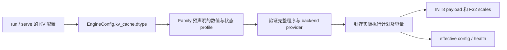

# vNext 8-bit KV 开发方案

状态：待实现、待实测的开发设计。日期：2026-09-17。本文确定实现方向与验收要求，不代表当前版本已经支持。

源码核对基线：本地 `b68576eb7e4f6ad4dc9526207bc7c41ba09bdb50`；当日远端 `main` 为 `1cff9e1328a7048cb2d4b12af2e63665ecac1f7c`。实现时先在目标分支重新核对接入点，不按历史行号机械移植。本文中的新增类型、字段、指标和错误示例均为拟议接口。

## 1. 要交付什么

让用户通过现有 `--kv-dtype int8`，在 vNext 的真实推理路径中使用 **INT8 K/V + F32 scales**，降低长上下文和多会话的 KV 内存开销。Metal 对应统一内存，CUDA 对应设备显存。

用户应能得到三个可验证的结果：

1. 同模型、同权重、同输入长度和并发下，实际 KV 驻留字节减少，整体内存变化有明细。
2. 在 KV 确实是容量瓶颈的负载中，相同内存预算能容纳更长上下文或更多会话；由真实边界测试给出结果。
3. 用户能看到实际生效的 KV 格式、运行路径及不支持原因，能切回 `fp16`。

默认仍为 F16。量化不删除聊天内容，也不替客户端总结上下文；它改变引擎保存中间状态的数值表示。它是有损量化，质量和速度必须验证，不能预先承诺“总显存减半”“上下文翻倍”“无损”或“必然加速”。

本项承接 [社区需求调研](next-release-community-research-2026-09-17.zh.md)。已有 prefix cache、continuous batching 和旧 CUDA INT8 kernel 是可复用基础，不重复计为本版新增功能。

## 2. 当前代码与真实缺口

| 位置 | 已有事实 | 本次需要补齐 |
| --- | --- | --- |
| [用户配置](../crates/ferrum-types/src/config.rs)、[run](../crates/ferrum-cli/src/commands/run.rs)、[serve](../crates/ferrum-cli/src/commands/serve.rs) | `KvCacheDtype::Int8` 和 `--kv-dtype` 已存在；`apply_kv_dtype_override` 接受 INT8 | 将请求值约束到 vNext 的实际静态计划；同时报告请求值和解析结果 |
| [executor 注册](../crates/ferrum-engine/src/registry.rs) | registered vNext 提前进入 `create_registered_vnext_executor`；后面的 legacy CUDA/Llama INT8 分支是另一条路径 | 不把 legacy 配置成功当成 vNext 支持证明 |
| [产品 composition](../crates/ferrum-engine/src/product_composition.rs) | 按 `numerical_execution` 枚举 family profile，prepare、compile、initialize | 加入 KV 存储约束及 provider 兼容性，禁止忽略显式 dtype |
| [共享 family 状态](../crates/ferrum-models/src/vnext/numerical.rs)、[hybrid 状态](../crates/ferrum-models/src/vnext/qwen35/numerical.rs) | causal KV 状态声明为 F16；recurrent state 另有自己的类型 | 生成包含量化 payload 和 scales 的完整 profile；保留其他状态原有精度 |
| [标准 attention 合约](../crates/ferrum-interfaces/src/vnext/standard_operations.rs) | 通用 causal attention 的 state 输入 port 8 固定 F16 | 新增版本化 INT8 合约、scale 输入和 checkpoint 声明 |
| [Metal provider](../crates/ferrum-kernels/src/backend/metal/vnext_ops/causal_attention.rs) | `state_bytes_per_token`、页绑定、`paged_state_regions` 固定 F16；有多条 attention dispatch | 容量、分配、写入、所有读取路径、批处理及恢复一起接通 |
| [CUDA provider](../crates/ferrum-kernels/src/backend/cuda/vnext_ops/transformer/causal_attention.rs) | token-major 和 native blocks16 路径均按 F16 KV 工作 | 新增 INT8 存储与执行路径，正确处理 native policy |
| [legacy INT8](../crates/ferrum-kernels/src/backend/cuda/int8_kv.rs)、[旧 kernel 封装](../crates/ferrum-kernels/src/int8_kv.rs) | 已有每 token/head 量化及直接反量化读取；使用独立 pool、block table 和 F16 scales | 可借鉴算法与测试，不能直接视为 vNext 的 resource/binding 实现 |
| [prefix cache](../crates/ferrum-models/src/executor/vnext_executor/prefix_cache.rs)、[恢复提交](../crates/ferrum-engine/src/continuous_engine/inner/prefix_restore.rs) | 已有进程内完整 checkpoint 和 token 进度恢复 | payload、scales、其他模型状态在同一边界完整捕获和恢复 |

上述结论来自静态接线与类型检查；本次没有运行模型复现 `--kv-dtype int8` 的实际表现。第一阶段必须增加产品行为测试，证明“请求值进入计划”，不能只测 CLI 解析。

现有 `F32_MASTER` 不等于 F32 KV。当前对应 attention 仍保存 F16 KV，本次只改变状态存储，不能顺带改变 hidden、residual 或权重的运算精度。现有源码注释中的“精度损失小于 1%”不是 vNext 的实测证据，实施时同步修正相关注释和 CLI 帮助。

## 3. 首版范围与支持规则

| 范围 | 本版决定 |
| --- | --- |
| 存储格式 | 一种版本化格式：有符号 INT8，K/V 分别按 token、KV head 量化，F32 scale，无 zero point |
| 后端 | Metal 和 CUDA 的通用 causal attention 分别实现、分别验收；阶段性完成一个后端不代表另一个可用 |
| attention | 首先覆盖通用 causal 合约及其已声明的 F16/F32-master 激活组合；MHA、GQA、MQA、head dimension 和 rotary 等按 provider 合同验证 |
| 模型 | 依据完整程序所需的 operation/capability 判定；标准 causal 调用者和 recurrent + causal 混合调用者都要选代表样本 |
| 两个入口 | `ferrum run`、`ferrum serve` 共用配置、解析和执行路径；服务端覆盖并发和 prefix 恢复 |
| CPU | 本版不增加 CPU INT8 生产 kernel；显式请求不支持的组合时拒绝，原有 F16 继续回归 |
| 特殊 attention | Gemma 的 hybrid/V-norm 和 GPT-OSS 的 sink/window/YaRN 等合约独立判定；未实现的 INT8 组合启动失败，不从通用 provider 推导支持 |
| 延后范围 | FP8、Q4、K/V 分开选择位宽、recurrent 状态量化、权重 offload、SSD 落盘/预读、MTP、自动按压力切换精度 |

这不是 Qwen3.5-9B 专项。模型只是验证样本；不能用模型名称、参数量、客户端名称选择量化 kernel。也不能因为一个样本成功，就宣布该 family 的所有权重、数值 profile、特殊 attention 语义都已覆盖。

首版不引入“部分 attention 层偷偷保留 F16”的混合模式。显式 `int8` 要求本计划内所有适用 KV 状态采用该格式；遇到未支持的必要 operation 则整体拒绝。没有 KV 状态的计划也应给出“不适用”，避免把无效果的配置报为已启用。

SSD 工作可在后续复用格式身份和容量统计，但本版不提供持久化保证，也不把数据压缩后再完整展开为 F16 来冒充运行时节省。

## 4. 数值与存储 ABI

### 4.1 固定首版量化规则

拟议 profile 标识为 `int8-per-token-head-f32-scale-v1`。这是存储 ABI 标识，不要求用户输入这个长名称。

对每层、每个绝对 token 位置、每个 KV head，K 和 V 各自形成长度 D 的向量。量化对象是**现有 F16 KV 写入边界产生的值**：先完成该 operation 原有的投影、归一化、RoPE 或其他必要变换及 F16 舍入，再转 F32 计算 scale。保持 Q 的处理及其他原有舍入边界。

```text
x = 原有 KV 写入边界的 F16 值，转为 F32
a = max(abs(x))
若 a == 0：s = 1，所有 q = 0
否则：s = a / 127，存为 F32
q = clamp(round_ties_to_even(x / s), -127, 127)，存为 I8
读取值 = F32(q) * s
```

约束：

- K 与 V 不共享 scale；不同 head/token 不共享 scale；`-128` 不由编码器产生。
- 量化使用实际保存的 F32 scale，除法、rounding 和 clamp 顺序写入 operation 的数值契约。禁止用各语言默认 cast 代替 ties-to-even。
- 因输入来自有限 F16，非零幅度对应的 F32 scale 可表示；全零专门处理，不抄用旧 F16 scale 路径中可能下溢为零的 epsilon 写法。
- NaN/Inf 不得当作 0 或有限饱和值悄悄写入。增加设备可汇总的数值错误状态；检测到时本次步骤失败，目标状态不继续使用、不发布 checkpoint。不得为每个 head 同步回 CPU。
- 当前 prefill chunk 中刚写入的 KV 与历史 KV 使用相同量化表示。禁止当前块偷读原始 F16、后续 decode 才读取 INT8，造成切分相关的隐式语义变化。
- attention 读取时按原有计算合同转换到所需的 F16/F32 tile 或寄存器；累加、softmax 和输出规则保持明确。允许有界 tile 工作区，禁止建立随整段历史增长的 F16 KV 镜像。

选择 per-token/head 是首版实现决策，尚无 Ferrum 质量保证。KIVI 的研究表明 K、V 的分布和适合的量化粒度可能不同；其 2-bit 方案与结果不能直接证明本方案的 8-bit 质量。若独立质量验证失败，应改进粒度并升级 ABI，或保持该组合不支持，不能仅放宽测试。[KIVI 论文](https://arxiv.org/abs/2402.02750v2)

### 4.2 采用两个独立、受管理的状态

每个适用 attention 层定义两个 `StateSpec`，而非把不同类型偷偷塞进现有 F16 buffer：

| 状态 | 单 token 逻辑形状 | 类型 | 每 token 字节 |
| --- | --- | --- | --- |
| `kv_quant` | `[2, Hkv, D]`，0 为 K，1 为 V | `ElementType::I8` | `2 × Hkv × D` |
| `kv_scale` | `[2, Hkv]`，与 payload 一一对应 | `ElementType::F32` | `2 × Hkv × 4` |

两者均为 `StateLifetime::Sequence`、`TokenScaled`，具有相同的 maximum tokens 和有效位置前沿。物理布局首版采用各自独立的 token-major 页；每个 state 的 token 记录不增加 per-token padding，以满足现有 `TokenMajorPrefix` 合约，物理页尾可以有对齐余量。位置必须依据 participant 的绝对 source token position 计算，不能用 packed batch 行号代替。可沿用 `StateInitialization::None`，前提是每个有效位置的 payload 和 scale 均完整写入后才能读取。

为量化版本新增 scale 输入，两个 state port 都声明读写及对应的物理映射。现有 F16 operation 保留原 ABI；新 INT8 operation/capability 使用独立且可验证的身份，不让旧版本合法接受另一种内存含义。新增接口名称由实现遵循现有注册规范确定。

两个状态分别进行页对齐和寻址，不假设页数量相同，也不假设 token 行或 tile 一定落在一页内。实现必须支持合法的跨页访问，或在 planning 阶段准确拒绝 provider 不支持的形状。尾页未写入容量不可读取。

## 5. 配置如何真正进入执行计划

复用 `KvCacheDtype`、CLI `--kv-dtype` 及配置文件的现有入口，不增加第二个互相竞争的 `--vnext-kv-*` 开关。环境变量只保留既有兼容性，首版完整行为通过 CLI/config 可表达。



具体规则：

1. family 预声明完整数值 profile，增加 typed KV 存储描述，关联 payload/scale 的 `StateId`、量化规则及 ABI。由 typed definition 重建并校验，不通过 profile 名称字符串或“发现某个 I8 tensor”推断格式。
2. 产品 composition 同时消费数值策略和 KV 请求。`numerical_execution=Auto` 只在 family 已取得使用资格的 `auto_preference` 集合中，筛选满足请求 KV 格式的候选；不能编译失败后退回不同存储格式。统一扩展 `FamilyNumericalProfiles::candidates` 和 [NumericalProfileResolution](../crates/ferrum-interfaces/src/vnext/numerical_resolution.rs) 的重建/拒绝顺序校验及 wire 身份，不能只在 composition 循环中临时过滤而让可信校验使用另一份候选列表。
3. 显式指定完整 numerical profile 时，profile 的 KV 声明必须与有效 `kv_dtype` 一致。冲突报配置错误并给出兼容选项，禁止修改已指定 profile 的含义。省略 `kv_dtype` 时沿现有默认 F16；选择 INT8 完整 profile 的用户须同时满足此约束，帮助信息应说明。
4. 保留现有 CLI/config/env 优先级并测试两个入口的一致性。解析后使用 typed 值，不在各 backend 再解析原始字符串。
5. CUDA composition/provider 筛选也接收 KV 需求。不能先仅按硬件解析成 F16 native provider，再把 INT8 状态塞进去。`Auto` 可选择直接消费 INT8 的 portable provider；用户显式 `NativeAdaptive` 而 native 不支持 INT8 时拒绝。
6. `ResolvedModelPlan`、profile、provider、physical layout 的指纹包含新的状态语义。计划初始化后不可随内存压力切换 dtype。
7. 启动日志及 effective config 输出请求 dtype、实际 storage profile、scale dtype/granularity、实际 attention provider 和拒绝原因。`serve` 的 health/capability 从 resolved plan 生成，不能由“硬件理论支持 INT8”生成。

预期使用方式，须待实现后验证；`MODEL` 是用户选定、已支持的模型来源：

```text
ferrum run MODEL --kv-dtype int8
ferrum serve MODEL --kv-dtype int8
```

不支持时应说明“哪个 operation、backend 或显式策略缺少此 storage profile”，并给出使用 `fp16` 的可执行建议。不能接受参数后仍在 F16 路径执行，也不能因 dtype 不支持在请求到达后才失败。

## 6. 容量、checkpoint 与所有权

### 6.1 所有成本从实际布局计算

单层、单 token 的逻辑容量为：

```text
F16       = 4 × Hkv × D
INT8+scale = 2 × Hkv × D + 8 × Hkv
比例       = 1/2 + 2/D
```

| Head dimension | INT8 + F32 scales / F16 | 逻辑 KV 减少量 |
| --- | --- | --- |
| 64 | 53.125% | 46.875% |
| 128 | 51.5625% | 48.4375% |
| 256 | 50.78125% | 49.21875% |

这些是格式算术，不是性能结果。实际按每层不同 Hkv/D 求和，并计入各状态页尾、对齐、allocator chunk、页表、临时 tile、错误标志及 checkpoint 副本。新增 scale 页在短上下文下可能使物理节省很小，甚至超过旧分配；必须报告。

通用说明例：假设 32 层均有 full-attention KV、8 个 KV heads、D=128、32768 个有效 token，则 F16 逻辑 KV 为 4 GiB，INT8 + F32 scales 为 2.0625 GiB。若另有 12 GiB 权重和其他开销，理想总量从 16 GiB 变为 14.0625 GiB，减少约 12.1%，不是减半。此例未计物理对齐，未对应任何已测模型。

实施要求：

- 修改 `StateCapacityDemand`、provider state geometry、plan resource、admission 和 checkpoint 估算所依赖的共同布局描述，避免分别手写一个“除以二”。所有乘法、对齐和最大 token 计算检查溢出。
- payload 与 scales 在同一资源事务内预备、提交和扩容；任一状态不足时不得发布另一半可用状态。页表、可复用 binding/replay key 同步更新并绑定 backing generation。
- 沿已有 `CapacityVector`、`DeviceCapacityBudget`、dynamic pool 记账；不另设未经预算的 GPU 分配器。活动状态、缓存副本和在途释放的 owner 都计费，别名不得重复计费。
- 明确区分有效内容字节、已分配状态字节、池保留字节和设备峰值。释放 sequence 后池可能保留可复用页，不能拿设备监控读数不立即下降证明泄漏，也不能仅用理论字节证明已节省。

### 6.2 恢复必须同时恢复数据和 scales

已有 checkpoint 能力继续使用。为原本可恢复的 attention 增加两个 state port 的 `PrefixPositions` / `TokenMajorPrefix` 描述，由计划验证完整状态闭包；未支持 checkpoint 的 family 不能因增加 scale 顺手宣称支持恢复。

捕获有效 `[0,N)` 的 payload 和 scales，并连同该模型原有 recurrent 等必要状态，在同一个已完成边界形成不可变 checkpoint。二者原样复制，恢复时不重新量化；未知容量尾部不复制。

checkpoint 身份至少覆盖模型实例/计划、完整 numerical profile、KV storage ABI、scale dtype/granularity、provider layout 和精确 token/位置语义。F16 与 INT8、不同量化版本的 checkpoint 均不兼容；此版不实现跨格式转换。

取消、扩容、capture、restore、淘汰遵循既有 session 仲裁、fence、reaper 和 quarantine。两个状态所有者保留到设备完成；不能在 payload 复制完成但 scale 仍在途时发布恢复成功。失败后不能只修正 token offset，把部分写入目标当作可继续执行的状态。

重点复用并扩展 [checkpoint 资源契约](../crates/ferrum-interfaces/src/vnext/resource/checkpoint.rs)、[checkpoint 布局推导](../crates/ferrum-interfaces/src/vnext/execution/sequence_checkpoint.rs)、[provider state port](../crates/ferrum-interfaces/src/vnext/operation/checkpoint/state_port.rs) 和已有 executor 恢复路径。首版维持现有深拷贝/隔离语义，不额外实现跨请求共享量化页。

## 7. Backend 实现清单

### 7.1 Metal

修改 [provider](../crates/ferrum-kernels/src/backend/metal/vnext_ops/causal_attention.rs) 和 [shader](../crates/ferrum-kernels/src/backend/metal/vnext_ops/causal_attention.metal)：

- prepare 写入阶段生成 payload/scales，保留原 norm/RoPE 的写入边界；output gate 保留在 attention 输出阶段，不进入 KV 量化。普通与 packed participant 路径一致。
- 分别构造 I8 和 F32 动态页绑定；更新 `state_bytes_per_token`、最大页数、参数结构、signature 和物理 view 验证，重算双页表 argument-buffer 的 encoded length、alignment 和资源声明。当前页为 64 KiB，不能继续使用 F16 的 `page_elements` 解释。
- 检查 `General`、`DirectDecode`、`GroupedDecode` 的 partial/reduce、`TiledPrefill`、`GqaTiledPrefill` 全部分支。direct 会直接读 `half*`，tiled/grouped 有 `simdgroup_load`；只改 `vnext_load_kv` 不会覆盖它们。
- INT8 tile 在寄存器/threadgroup 中解码后按明确数值合同运算；scale 索引与 KV 行一致，跨页和尾块不越界。
- 第一正确性切片允许统一使用已实现的 INT8 General，但必须记录实际 dispatch。交付前按选定性能预算验证 prefill/decode；不能用严重变慢的路径证明整个功能已完成。

### 7.2 CUDA

修改 [provider](../crates/ferrum-kernels/src/backend/cuda/vnext_ops/transformer/causal_attention.rs) 和 [kernel](../crates/ferrum-kernels/kernels/vnext_causal_attention.cu)：

- 首版实现 token-major INT8 portable 路径，更新两个状态的 binding、shape、page geometry、容量、prepare/read kernels。
- 所有 batch participant 按自己的 source range 和 state owner 寻址；覆盖不同前缀长度、chunked prefill、decode 与可复用 binding/replay。
- 使用有界 tile/在线 softmax等现有可扩展方式。旧 INT8 decode kernel 的动态 shared memory 随上下文增长，不能直接作为长上下文通用实现。
- 现有 [native addressed attention](../crates/ferrum-kernels/src/backend/cuda/vllm_paged_attn.rs) 的入口是 F16、blocks16 等固定 ABI，不能传入 INT8 指针。首次交付可由 `Auto` 选择 INT8 portable，并报告相对 F16 native 的真实速度变化。
- 若后续补 native decode 或 [paged varlen prefill](../crates/ferrum-kernels/kernels/paged_varlen_attention_vllm.cu) 的 INT8 路径，按各自覆盖范围更新对应 kernel；两者可以独立实施。新增外部 native operator 时同步 ABI/lock 和发布构建。
- 独立 [GPT-OSS provider](../crates/ferrum-kernels/src/backend/cuda/vnext_ops/transformer/gpt_oss_attention.rs) 不自动继承支持；其特殊语义没有完整实现时在静态阶段拒绝。

## 8. 实施顺序与可评审切片

各切片均保持默认 F16 可用；未完成的 INT8 组合明确拒绝。以下是依赖顺序，不是工期承诺。

| 阶段 | 交付物 | 完成条件 |
| --- | --- | --- |
| P0：基线与配置约束 | 核对目标分支；记录代表负载的权重/KV/recurrent/workspace/checkpoint 内存构成；补 vNext 显式 dtype 校验 | 能证明当前请求值是否生效；不支持时准确失败，不能把这一步当量化功能完成 |
| P1：公共合约 | typed storage profile、两个 StateSpec、版本化 attention、Rust reference codec、容量和 identity | 无硬件测试覆盖格式、溢出、配置冲突、完整状态、跨 dtype 拒绝 |
| P2-M：Metal 贯通 | provider、量化写入、直接 INT8 读取、batch、checkpoint | 实际 Metal 执行通过 kernel/provider 和完整模型两层验证 |
| P2-C：CUDA 贯通 | portable INT8、provider policy、batch/replay、checkpoint 接入 | 实际 CUDA 执行通过；native 不支持边界明确 |
| P3：产品与容量 | run/serve、effective config/health、并发/取消/恢复、容量边界 | 两入口使用相同 resolved profile，物理节省与容量决策一致 |
| P4：质量和性能资格 | 配对质量、长上下文、工具流程、冷/热缓存、同负载和同预算测量 | 各后端按支持声明分别出具结果与限制；填写发布门槛后才标记可交付 |
| P5：发布新版本 | 合并已验证实现，更新 workspace 版本、changelog、支持说明；沿既有 RC / release-delivery 流程构建、验收并发布 | 正式 release、发行资产和安装入口可用；公布各后端实际支持与验证范围，完成公开安装后的 run/serve 检查 |

Metal/CUDA 在 P1 合约稳定后可以并行实施。任一路径的格式或数值规则变化必须升级共同 ABI 并补交叉 reference 验证，不能形成两个名字相同、含义不同的 `int8`。

## 9. 正确性与质量验证

### 9.1 无硬件契约测试

测试放入既有 Rust crates，fixtures 使用 typed builder；不添加 Python/shell 测试包装器。

- codec：零、正负、ties-to-even、极小有限 F16、最大有限 F16、单个 outlier、饱和边界、非有限拒绝；验证 q 范围、scale 有效性和反量化误差界。量化误差界采用 `s/2` 加明确浮点运算误差，不能只测 cosine。
- 合约：完整 profile 可以可信重建；请求/实际 dtype 一致；显式 numerical profile 冲突；未支持 provider/CPU/native policy 失败；权重格式不隐式决定 KV 精度。
- 容量：分开的 payload/scale 页、尾页、扩容、零/最大容量、整数溢出、不足一页预算、其中一个状态分配失败、事务回滚和预算唤醒。
- 身份/生命周期：F16 与 INT8 不复用；scale ABI 不同不复用；部分提交不得完成；取消、过期 generation、fence 失败/未知、索引淘汰后在途 owner 仍有效。

### 9.2 实际 backend 测试

先以同一量化规则的 Rust reference 检查设备实现，再与 F16 比较量化带来的变化，分别定位“实现错误”和“量化误差”。分块/批处理测试使用合同规定的容差；有意不同的规约顺序不能假装逐 bit 相同。

覆盖合法的 MHA/GQA/MQA、不同 head dimension/rotary、非连续页、页前后位置、部分页、prefill 长短 chunk、长历史 decode、混合长度 batch、输出 alias 模式。对每个声称支持的 dispatch/优化分支建立能触发它的行为测试。

恢复测试：INT8 冷算与同 profile 热恢复对照；一个 checkpoint 恢复到多个目标后分别追加不同 suffix；源继续生成，任一目标取消，其他目标和原 checkpoint 的 payload/scales 均不受改写。混合模型的 recurrent 状态必须与 KV 位于同一 token 边界。

复用入口：

- Metal：[attention tests](../crates/ferrum-kernels/src/backend/metal/vnext_ops/causal_attention_tests.rs)、[checkpoint kernel tests](../crates/ferrum-kernels/src/backend/metal/vnext_ops/causal_attention_checkpoint_tests.rs)、[完整 continuation](../crates/ferrum-models/tests/vnext_metal_checkpoint_continuation.rs)。
- CUDA：[numerical tests](../crates/ferrum-kernels/src/backend/cuda/vnext_ops/transformer/causal_attention/numerical_tests.rs)、[replay contract](../crates/ferrum-kernels/tests/cuda_vnext_replay_contract_test.rs)。
- 公共资源：[checkpoint capacity](../crates/ferrum-interfaces/tests/vnext_checkpoint_capacity_contract_tests.rs)、[sequence checkpoint](../crates/ferrum-interfaces/tests/vnext_sequence_checkpoint_contract_tests.rs)、[numerical profiles](../crates/ferrum-interfaces/tests/vnext_numerical_profile_contract_tests.rs)。

已有 kernel checkpoint 测试只证明其覆盖层；既有 legacy INT8 测试及 `#[ignore]` CUDA 测试也不能自动成为 vNext 产品证据。必须记录真正执行的测试、失败和因设备缺失而跳过的项。

### 9.3 真实模型与产品质量

按受影响的 operation/provider 选样，至少区分纯 causal 和 recurrent + causal；原已支持且被本次修改触及的数值 profile、权重路径分别回归。测试尺寸按目标硬件和边界选择，不固定为一个 9B，也不机械排列所有品牌。

采用两类配对证据：

1. **固定 token 的 teacher-forced 对照**：F16 与 INT8 使用相同 token 序列、权重和边界，记录 ΔNLL、logits 分布差异、随历史长度的变化和异常值。避免生成分叉后把不同上下文的 logits 当作直接对照。复用模型 executor 测试入口；缺少批量评分时，在 Rust devtools/testkit 内补可复用逻辑。
2. **实际任务对照**：长上下文信息提取、代码/结构化输出、tool call 及工具结果续答、多轮追加与不同历史长度。分别记录协议有效性和内容正确性；HTTP 200、可解析 JSON、偶然相同文本都不是质量证明。

在观察最终候选结果前，冻结评估语料、分组、F16 基线误差及各任务可接受退化预算；校准/调参集与最终评估集分开。质量阈值按任务风险、F16 基线变异和产品要求确定，不从某篇论文或旧注释抄一个通用“低于 1%”。缺少冻结阈值时只能标记“已测量、尚未取得发布资格”。

## 10. 性能、内存与用户收益验收

### 10.1 必须回答的指标

| 问题 | 必须记录的证据 |
| --- | --- |
| 真在用 INT8 吗？ | 请求/实际 profile、provider、payload/scales dtype、分配字节；kernel 与计划相符 |
| 省了多少？ | 活动 KV、scale、checkpoint、其他状态、workspace、池驻留和设备/进程峰值；Metal 说明统一内存测量口径 |
| 能多装多少？ | 相同预算下最大可完成上下文或可完成并发；通过合法准入/拒绝边界验证，保留失败原因 |
| 有没有变慢？ | prefill 时间、TTFT、TPOT/真实 token 速率、端到端延迟、吞吐，以及长 prefill 对已有 decoder 的停顿 |
| 缓存组合是否有效？ | 冷算、首次 capture、热恢复分开记录；真实 restored tokens、实际计算 tokens、复制字节和时间 |
| 输出能用吗？ | 错误、截断、超时、非有限、协议失败与语义失败同时报告，不删除失败请求后只算速度 |

新增指标沿既有 profile/容量/benchmark 输出扩展，避免建第二套统计系统。SSE 文本事件数不等于模型 token 数；如果客户端只能测事件间隔，应明确标记，不能称为 TPOT。

### 10.2 两组比较都要有

- **同负载**：相同硬件、模型文件及 revision、权重精度、输入/输出 token、并发、chunk 策略、prefix 预算、采样和预热方法，比较 F16 与 INT8 的内存与延迟。自动选择导致 F16 native / INT8 portable 时记录这个有意差异；必要时补 portable 对 portable，以区分格式与 provider 切换成本。
- **同预算**：冻结相同 usable memory budget，逐步探测真实容量边界，验证新增空间是否能完成更长输入或更多会话。不能只把理论 bytes/token 除预算后宣布上下文提升；模型原有上下文上限和其他资源约束仍生效。

复用 [bench-serve](../crates/ferrum-cli/src/commands/bench_serve.rs)、[decode isolation](../crates/ferrum-cli/src/commands/bench_serve/decode_isolation.rs) 和已有 Rust 原始请求回放工具。随机 token 负载用于隔离容量/调度；质量验证使用有语义的数据，两者分别报告。

报告记录硬件、OS/driver、server/client 版本、模型来源/精度、数据集、实际长度、完整命令、配置、重复次数、分布及不确定性。重复次数按噪声和稳定性决定，不把固定次数或 PASS 比例当门槛。模型、日志、profile 和完整结果放仓库外，仓库只保留小型确定性 fixtures、运行配置和结果摘要链接。

### 10.3 发布判定

只有下面条件共同满足，才可宣称对应 backend/profile 交付：

- 显式 INT8 请求真实生效，unsupported 组合准确拒绝，默认 F16 路径回归通过。
- payload/scales 的真实容量与布局公式一致，所有者/恢复/取消测试通过，无隐藏整历史 F16 副本。
- 在预先选定、KV 确为瓶颈的代表负载中，实际内存减少；容量扩展负载能完成，不能靠截断、减少输出或禁用必要状态换取数字。
- 质量达到预先冻结的任务门槛；性能符合该场景事先声明的延迟/吞吐退化预算。允许“省内存但略慢”的明确产品取舍，不允许未经报告的退化。
- `run` 与 `serve` 均有真实模型证据；Metal/CUDA 分别列结果。没有 CUDA 设备时可完成文档和 Metal 工作，但 CUDA 发布资格保持未验证。

若主要负载瓶颈是权重或 recurrent state，KV 量化可能帮助有限。P0 内存构成核对后应据实调整收益预期；不能为维持宣传结论改用不相关的短请求或单一模型结果。

## 11. 工程检查与完成记录

实现从最小受影响 Rust 测试开始。稳定代码里程碑执行：

```text
cargo fmt --all -- --check
cargo check --workspace --all-targets
cargo test --workspace --all-targets
cargo clippy --workspace --all-targets -- -A warnings
cargo check --workspace --all-targets --features metal
cargo check -p ferrum-cli --bin ferrum --features cuda,vllm-moe-marlin,vllm-paged-attn-v2
```

Metal compile 在 macOS 执行；CUDA compile 需要配置好的 CUDA 主机和 CI 指定的 `FERRUM_NATIVE_OPERATOR_SET_LOCK`。这两个 compile check 都不能替代 backend runtime 回归。Clippy 当前允许 warnings，按仓库要求报告，不能把容忍失败的 CI job 概括成全部测试通过。

完成记录至少填写：

| 项目 | 当前状态 |
| --- | --- |
| 源码路径、现有 F16 限制与 legacy 区分 | 已静态核对；未运行模型 |
| 新 ABI、profile/config、容量与恢复 | 已实现，typed 合约与 Metal 双状态恢复测试通过；详见验证记录 |
| Metal / CUDA / run / serve | 实现已进入开发分支；Metal kernel/provider 已本机运行，CUDA 与真实 run/serve 模型验收继续进行 |
| 质量门槛与冻结语料 | 待在 P0/P1 准备并冻结 |
| 实际内存、可达容量、延迟与吞吐 | 未测量，无收益承诺 |
| SSD 保存/加载 | 不属于本项交付 |

实施中的命令、实际结果和未完成项记录在 [验证记录](vnext-8bit-kv-validation.zh.md)。设计要求不等同于已验证结果；仅在相应检查真正执行后更新完成状态。

## 12. 发布新版本任务（2026-09-17 追加）

用户已要求开始实施并发布新版本。发布是本项交付任务，不能在文档、开发分支或草稿 PR 完成后就标记整个目标完成。

- 从当前远端主分支创建独立开发分支，保留其他工作区改动；按 P0–P4 实施和验证。
- 发布准备时核对当前正式版本、已合并变更及版本规则，确定新的版本号；使用仓库现有 Rust 版本工具同步 workspace/internal dependency 版本，不提前占用 tag。
- 更新 changelog、CLI 帮助和用户文档，说明启用方法、默认 F16、已验证模型能力/backend 组合、内存与速度实测及已知限制。未支持的组合必须有明确错误。
- 使用既有 [release candidate 自动化](release-candidate-automation.md)、[发布回归规则](release-regression-policy.zh.md) 和 `.github/workflows/prepare-release.yml` / `release-delivery.yml`；按实际变更范围完成 CI、模型、发行资产和公开安装验证。
- 仅将通过发布门槛的候选提升为正式版本，发布说明链接可复核证据。任何后端编译、runtime、质量或安装验证被跳过或失败，都要明确记录，不能以另一后端结果替代。
- 发布后检查 release/tag/资产/校验信息与版本一致，以及公开安装后的 `run`、`serve` 基本行为。保留可回退的既有稳定版本和清晰的配置回退方式。

发布授权已经包含在本次任务中；按上述证据推进，无需为同一发布步骤重复申请确认。遇到真实外部权限或凭据缺口时，先完成不依赖它的工作，再准确报告阻塞。
